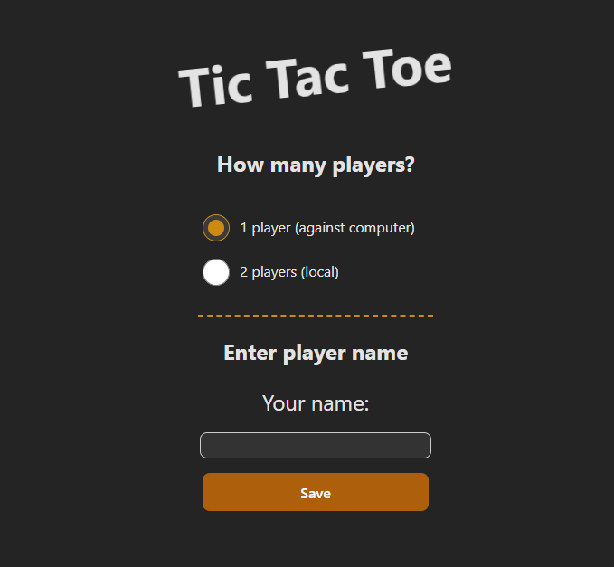
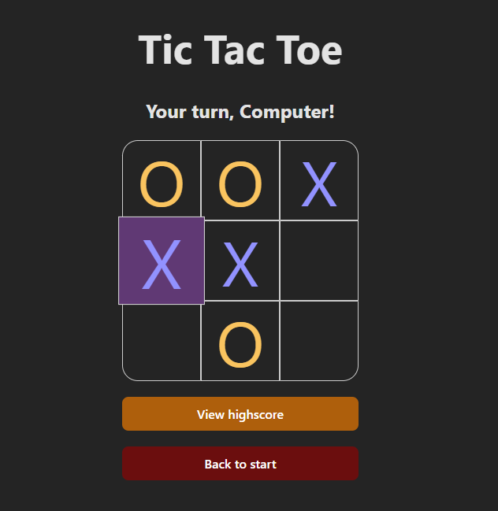
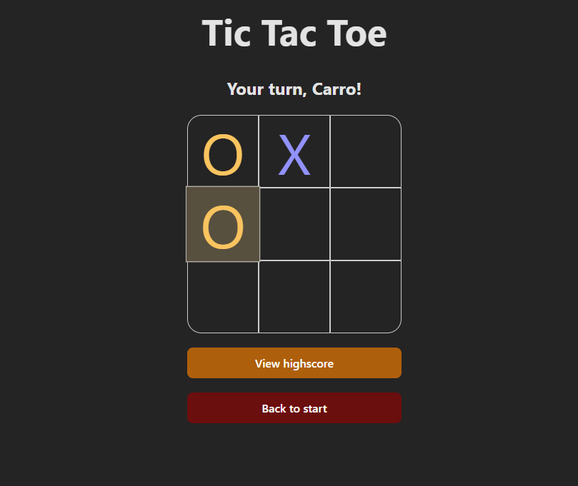
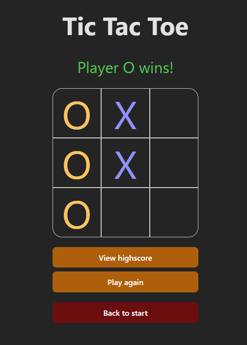
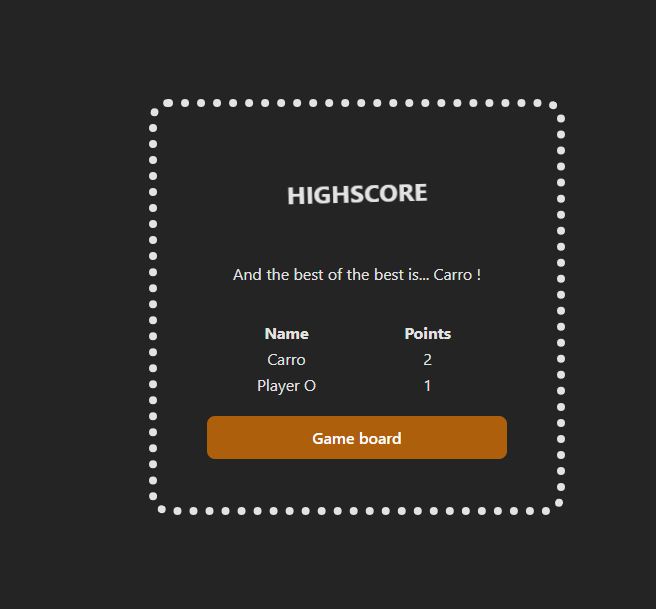

# ASSIGNMENT - TIC TAC TOE
_Course: JavaScript - Advanced_
> Visit my project: https://medieinstitutet.github.io/vue-tictactoe-CarolineVarsaga/ 

### START THE PROJECT
> **npm i** 
  **npm run dev**

## SCREENSHOTS
### GAMEPLAY

In singleplayer-mode, it's you against the computer.

  In multiplayer-mode, you and your friend plays against each other localy. 

  When a game ends, the "Play again"-button appears.

 If you click on "Highscore", the highscore-page appears.

### LIGHTHOUSE

## WHAT I USED
Built with: 
- Vue
- Vite
- CSS/SASS
- TypeScript

## ABOUT THIS PROJECT 
In this assignment, my task was to build a tic tac toe-game in one week. The focus was on Vue - states, props and emits. The following requirements were to be included: 

- Be able to enter player names for X and O
- Be able to play a game and determine a winner or a draw
- Prevent making additional moves after the game is over
- Be able to start a new game
- Use at least one component

For even better grade: 

- Use at least three components for your solution
- Save score history for the players
- Be able to display score statistics
- Be able to close the browser and return to where the game left off
- Be able to reset statistics and start over with new players

## ABOUT THE PROCESS AND THOUGHTS
I started with a pen and paper and skissed up the logic. After that I started with the landing page and worked it one step at a time, deeper into the logic. 

If I would do this again, I would try to use even more components. Break it down even more. Now pretty much code ended up in the same component. 
I believe I would have created a separate SCSS-file too. 

It has been a fun project. I will practice more Vue in the future. 

_Learning **is** doing!_ :)

## AUTHOR
_Caroline Vårsaga -2024_
 _Studying "Front End Developer" at Medieinstituet_
- GitHub: https://github.com/CarolineVarsaga
- LinkedIn: https://www.linkedin.com/in/caroline-varsaga
